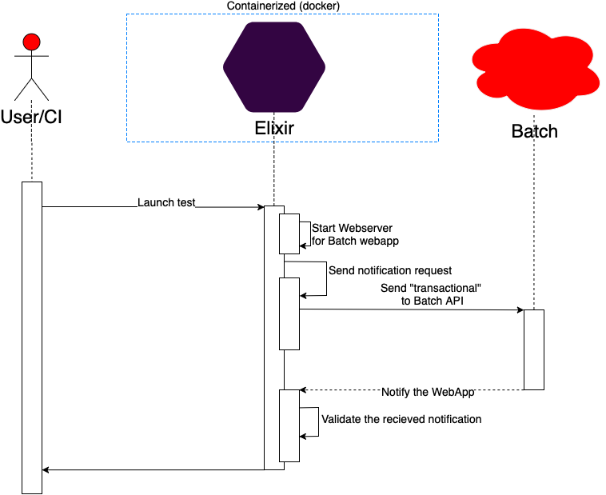

# BehaviourTest



It's a simple project made to test the **batch_elixir**.

* The `elixir` folder contains the elixir code wrapping the **batch_elixir** with an HTTP endpoint.
* The `nodejs` folder contains the code for the webapp server

## Testing

### Docker image

The docker image is based on elixir 1.6 deiban stretch with java, selenium and firefox

### Requirements

In order to launch the test you need `docker` and `docker-compose`

### Launch

You will need the `rest api key` you can either

* export the variable `REST_API_KEY`
* Set it when asked in the launch script.

```sh
./launch.sh
```

### Testing without docker

To test without docker you will need

* the last version of firefox
* Java 8+
* Selenium standalone [https://selenium-release.storage.googleapis.com/3.13/selenium-server-standalone-3.13.0.jar](https://selenium-release.storage.googleapis.com/3.13/selenium-server-standalone-3.13.0.jar)
* the gecko driver [https://github.com/mozilla/geckodriver](https://github.com/mozilla/geckodriver)

Steps to launch the tests:

* Update the config/config.exs to add
    ```elixir
    config :batch_elixir, rest_api_key: "rest api key"
    ```
* Launch selenium
    ```bash
    java -Dwebdriver.gecko.driver=/path/to/geckodriver -jar /path/to/selenium-standalone
    ```
* Launch the test
    ```bash
    mix test
    ```